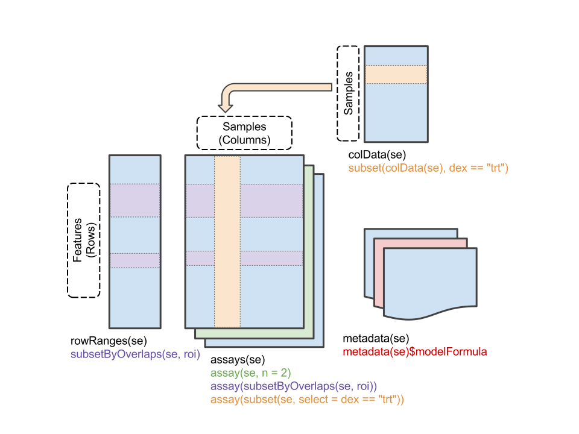

```{r setup, include=FALSE}
knitr::opts_chunk$set(echo = TRUE, retina=2, cache=TRUE, autodep=TRUE)
```

# Introduction

Today we're going to look at a data set from my work. This data comes
from menchymnal stem cells (MSCs) cultured from 9 cynomolgus monkeys
(a closely related species to rhesus macaques). MSCs are known to have
immune modulatory effects, and the main goal of the project is to test
whether these stem cells, when activated with interferon gamma (IFNg),
can help suppress the body's immune response against an organ
transplant.


The purpose of this specific data set is simply to determine which
genes' expression is affected when MSCs are treated with IFNg. As
such, we have both untreated (Control) samples and IFNg-treated
samples from 3 different passages of the cell cultures. So, we'll be
using limma to test each gene for differential expression between
Control and IFNg samples.

# Preliminary setup

First, let's install all the packages we'll need.

```{r install_pkgs, eval=FALSE}
needed_packages <- c("edgeR", "limma", "SummarizedExperiment", "ggplot2", "locfit", "dplyr", "statmod")
already_installed_packages <- rownames(installed.packages())
need_to_install <- setdiff(needed_packages, already_installed_packages)
if (length(need_to_install) > 0) {
    ## http://bioconductor.org/install/
    source("https://bioconductor.org/biocLite.R")
    biocLite(need_to_install)
}
```

Then we'll load those packages.

```{r load_pkgs, results="hide", message=FALSE}
library(SummarizedExperiment)
library(edgeR)
library(limma)
library(ggplot2)
library(dplyr)
```

# Initial data loading and exploration

Let's load the data file. This uses the `readRDS` function, which
reads a single R object from a file and returns it. We assign the
result to a variable.

```{r loading_data}
sexp <- readRDS(gzcon(url("https://www.dropbox.com/s/4lx6q9fgyz66rky/Cyno-RNASeq-SummarizedExperiment.RDS?dl=1")))
print(sexp)
```

This object is called a SummarizedExperiment, and its purpose is to
hold the experimental data, sample metadata, gene metadata, and any
other relevant information for the experiment all in one place. This
makes it an excellent starting point for any analysis. In our case,
the experimental data consists of a matrix of counts for each gene in
each sample. This count matrix was generated by aligning all the RNA
sequence reads in each sample to the
[cyno genome](http://www.ncbi.nlm.nih.gov/genome/776) and then
counting the number of uniquely-mapped reads that overlap each gene. I
have done the aligning and counting process for you and provided the
count matrix, since the alignment and counting would take many hours
to commplete.

Look at the output of the print statement above. The RNA-Seq read
counts are contained in the `assays` slot. The `colData` slot contains
information on the samples, while the `rowRanges` slot contains
information on the genes. The rows have "ranges" instead of just
"data" because in addition to things like the gene symbol and
description, the `rowRanges` slot also contains the genomic
coordinates of each gene, that is, the chromosome, start/end positions
of each exon, and the strand. This is the same information that was
used to count the overlapping reads for each gene, but we won't be
needing it today.

You can read more about SummarizedExperiment objects
[here](http://bioconductor.org/packages/release/bioc/vignettes/SummarizedExperiment/inst/doc/SummarizedExperiment.html).



* How many samples does this SummarizedExperiment object contain? How
  many genes does it have? Where did you find this information?
* What happens when you try to select a subset of rows or columns?

## Extracting the data and metadata

Ok, let's pull out the information that we want from this
SummarizedExperiment.

First, the sample information:

```{r extract_sampletable}
sample_table <- as.data.frame(colData(sexp))
```

Next, the gene information:

```{r extract_geneinfo}
## Gene metadata
gene_info <- as.data.frame(mcols(sexp))
```

And finally, the count matrix:

```{r extract_counts}
count_matrix <- assay(sexp)
```

Examine the `sample_table`, `gene_info`, and `count_matrix` objects.
Try `dim`, `class`, `nrow`, `ncol`, and similar. Try viewing the first
few rows or columns of each one.

* What kind of object is each one?
* What kind of data do they contain?
* Which dimensions do they have in common? How do these dimensions
  match up to the dimension of the SummarizedExperiment?

```{r example_sexp_components, include=FALSE}
dim(sexp)
dim(sample_table)
dim(gene_info)
dim(count_matrix)

head(sample_table)
head(gene_info)
## Find the IFNG gene
gene_info[which(gene_info$symbol == "IFNG"),]
count_matrix[1:10,1:6]
```

## Learning about the experimental design from the sample table

Before we get to the analysis, we need to have a closer look at the
sample table, to gain a better understanding of the experimental
design.

```{r head_sample_table}
names(sample_table)
head(sample_table)
```

* How many Labs/Runs/Animals/Passages/Treatments are there in this
  experiment?
* How many samples are in each one?

(You may find the `unique` and `table` functions useful for answering
these questions.)

```{r tabulate_samples, include=FALSE}
lapply(sample_table[-1], unique)
lapply(sample_table[-1], table)
```
* How many Animals are there in each Lab?
* Are there Animals with samples from both Labs?

```{r tabulate_animals_in_labs}
table(sample_table$Animal.ID, sample_table$Lab)
```

* How many sequencing Runs are there in each Lab?
* How many Animals are there in each sequencing Run?
* Are there Animals with samples from multiple sequencing Runs?
* Is it better to put all of each animal's samples in the same run, or
  is it better to distribute each animal's samples across multiple
  runs?

```{r tabulate_more_things, include=FALSE}
table(sample_table$Animal.ID, sample_table$Run)
table(sample_table$Run, sample_table$Lab)
```

# Performing a basic limma analysis #

## Filtering non-expressed genes ##

Our count matrix contains information on every known gene in the cyno
genome, but we only want to look at the genes that are expressed in
MSCs. Many genes will not be expressed at all and will have zero or
very few counts in all samples, and the statistical method breaks down
when it is fed all zeros. So we need to decide on a threshold of gene
detection and filter out all the genes whose average expression does
not reach this threshold. Let's see how a threshold of logCPM = 1
looks on a histogram and a QQ plot against normal distribution
quantiles.

```{r plot_cpm_threshold, fig.cap="logCPM histogram with threshold line"}
mean_log_cpm <- aveLogCPM(count_matrix)
filter_threshold <- 1
ggplot() + aes(x=mean_log_cpm) +
    geom_histogram(binwidth=0.2) +
    geom_vline(xintercept=filter_threshold) +
    ggtitle("Histogram of mean expression values")
```

```{r plot_cpm_qq, fig.cap="logCPM QQ plot with threshold line"}
qqnorm(mean_log_cpm); abline(h=filter_threshold)
```

* What do the shapes of these two plots indicate?
* How can we justify our choice of threshold using these plots?
* Would this same detection threshold be appropriate for other
  experiments?
* What biological or experimental factors might influence the choice
  of threshold?

Having chosen our threshold, let's pick the subset of genes whose
average expression passes that threshold.

```{r filter_genes}
keep_genes <- mean_log_cpm >= 1
filtered_count_matrix <- count_matrix[keep_genes,]
filtered_gene_info <- gene_info[keep_genes,]
nrow(filtered_count_matrix)
```

* What fraction of the genes in the genome are considered expressed
  according to our threshold?
* Is this number sensitive to our choice of threshold? How much of a
  difference does it make if we use a threshold of 0.5 or 1.5 instead?

```{r threshold_sensitivity, include=FALSE}
mean(keep_genes)
mean(mean_log_cpm >= 1.5)
mean(mean_log_cpm >= 0.5)
```

## Normalization ##

Ok, now that we have some understanding of the experimental design,
let's find some differentially expressed genes! We'll start by
computing the total counts in each sample and then normalizing these
total counts using the Trimmed Mean of M-values (TMM) method, provided
by the `calcNormFactors` function.

```{r calcNormFactors}
total_counts <- colSums(count_matrix)
nf <- calcNormFactors(count_matrix, lib.size=total_counts, method="TMM")
print(nf)
normalized_total_counts <- total_counts * nf
```

* What is the range of total_counts/normalization factors? (Try the
  `summary` function)
* What is the average total count per sample? Does this seem high or
  low? How might we expect this to affect our results?

```{r inspect_nf, include=FALSE}
summary(total_counts)
summary(nf)
```

## Fitting the linear models ##

Now that we have computed our normalization and filtered out
non-expressed genes, it's time to fit our linear models. The basic
model fitting function provided by limma is `lmFit`, which is
essentially a shortcut for running `lm` once for each gene, using the
same model formula each time.

First, we will construct our design matrix by selecting an appropriate
model formula. This step is performed automatically when you run `lm`,
but for `lmFit` we must do it manually. For our first model, we'll
keep it simple and use Treatment as the only covariate.

```{r design}
design <- model.matrix(~ Treatment, data=sample_table)
head(design)
```

Note that the design has two columns, representing the two
coefficients in our model. The first one, named `(Intercept)`,
represents the expression level of the Control samples, while the
second coefficient represents the difference between Control and IFNg
treatments. This is the coefficient that we will test for differential
expression once we have fit our model. This model will be equivalent
to a simple two-sample t-test.

Before we fit our model, we have to run `voom` to compensate for the
heteroskedasticity of the counts. (While we're at it, we also insert
the gene metadata into the resulting object. This will allow limma to
include the gene metadata its result tables automatically.)

```{r voom, fig.cap="Voom diagnostic plot"}
v <- voom(filtered_count_matrix, design, lib.size=normalized_total_counts, plot=TRUE)
v$genes <- filtered_gene_info
```

Running `voom` with `plot=TRUE` produces a diagnostic plot showing the
empirical relationship between log count and variance. The fitted
curve is a running average of the cloud of points, and this curve is
what voom uses to assign a weight to each observed count.

* According to the plot, which count would have the highest weight
  (i.e. the lowest expected variance): 4, 30, or 30000? (Remember the
  log2 scale)
* Which would have the lowest weight?
* Is the relationship between log count and variance monotonic? Why
  might it not be monotonic, if higher counts are supposed to be more
  precise?
* Why does `voom` need to know our experimental design?

The object returned by `voom` is an `EList`, which is a complex object
similar in spirit to a SummarizedExperiment. You don't need to know
anything about its internals. Just know that it contains both the
matrix of log2(CPM) values and the corresponding matrix of weights. It
also contains the gene info, which we added manually. Together with
the design matrix, this is everything we need to fit our linear
models.

```{r lmfit}
fit <- lmFit(v, design)
fit <- eBayes(fit, robust=TRUE)
```

Recall that the `eBayes` function is responsible for squeezing each
gene's sample variance toward the overall mean variance of the whole
data set, in the process trading a bit of bias for stability.

## Getting our results ##

Anyway, now we can perform a "moderated t-test". "Moderated" means
that we are substituting the empirical Bayes squeezed variance for the
sample variance in the formula for the t statistic (and also adjusting
the degrees of freedom term accordingly). To get our results, we call
`topTable`, telling it which coefficient we wish to test, along with
which multiple testing correction to use on the p-values. The `n=Inf`
tells it to give us the results for all the genes in the data set.

```{r results}
results <- topTable(fit, coef="TreatmentIFNg", adjust.method="BH", n=Inf)
head(results)
```

* What is the estimated FDR for the most significant gene (the FDR is
  stored in the `adj.P.Val` column)?
* How many genes are significantly differentially expressed at a
  threshold of 10% FDR?
* Do you see any genes that make biological sense in the top few
  results?

```{r num_sig, include=FALSE}
results$adj.P.Val[1]
table(results$adj.P.Val <= 0.1)
```

Now let's inspect the p-value histogram. For reference, we'll add in a
horizontal line indicating what a uniform distribution would look
like.

```{r pval_hist, fig.cap="P-value histogram for the first analysis"}
ggplot(results) +
    aes(x=P.Value) +
    geom_histogram(aes(y=..density..), binwidth=0.025, boundary=0) +
    geom_hline(yintercept=1) +
    ggtitle("P-value distribution for Control vs Treatment")
```

* What can we conclude from this histogram?

Lastly, we can generate an MA plot showing the log2 fold change vs the
log2 CPM for each gene:

```{r maplot}
ggplot(arrange(results, desc(P.Value))) +
    aes(x=AveExpr, y=logFC,
         color=ifelse(adj.P.Val <= 0.1, "FDR <= 10%", "FDR > 10%")) +
    geom_point(size=0.1) +
    scale_color_hue(name="Significance") +
    theme(legend.justification=c(1,1), legend.position=c(1,1)) +
    ggtitle("MA Plot, IFNg vs Control")
```

Another common plot is the volcano plot, which plots significance vs
log fold change:

```{r volcanoplot}
ggplot(arrange(results, desc(P.Value))) +
    aes(x=logFC, y=-log10(P.Value),
         color=ifelse(adj.P.Val <= 0.1, "FDR <= 10%", "FDR > 10%")) +
    geom_point(size=0.1) +
    scale_color_hue(name="Significance") +
    theme(legend.justification=c(1,1), legend.position=c(1,1)) +
    ggtitle("Volcano Plot, IFNg vs Control")
```

* Based on these plots, are the changes balanced between up and down,
  or is there a bias toward a certain direction of change? Does this
  make sense for the biology of interferon treatment?


# Improving the analysis by exploring the data

We got pretty good results above, but how do we know that we analyzed
the data correctly? Are there any important covariates that we should
have included in our model? How can we figure out which covariates are
important? One way is to do a PCA plot. Limma actually provides
something called an MDS or PCoA plot, which is slightly different from
a PCA plot but serves the same purpose.

```{r mds_init, fig.cap="Basic MDS plot from limma"}
mds <- data.frame(plotMDS(v)[c("x", "y")])
```

Limma's `plotMDS` function creates an MDS plot using the sample
labels, but this results in a very crowded plot. Luckily, it also
returns the x and y coordinates of the plot, which we can use to make
our own. Because we want to see how each covariate relates to the
principal coordinates, let's make several versions of our MDS plot,
colored by each covariate.

```{r mds, results="hide"}
mds <- cbind(mds, sample_table)
p <- ggplot(mds) +
    aes(x=x, y=y) +
    xlab("PC1") + ylab("PC2") +
    geom_point(size=3) +
    coord_fixed(ratio=1) +
    ggtitle("Sample MDS Plot")
for (i in c("Lab", "Run", "Animal.ID", "Passage", "Treatment")) {
    print(p + aes_string(color=i) +
          ggtitle(paste("Sample MDS Plot Colored by", i)))
}
```

* Based on the MDS plots, which variables seem to be important, and
  which do not?

## Investigating an outlier

You might have noticed that a few of the IFNg-treated samples cluster
with the Control samples. These look like possible outlier samples,
and we should investigate them, since they could interfere with our
model fit. Let's try coloring by Animal ID and using a different shape
for the IFNg samples.

```{r id_outlier, fig.cap="MDS plot for identifying the outlier animal"}
p + aes(color=Animal.ID, shape=Treatment)
```

* Can you identify the misbehaving Animal?

Let's remove the samples for this animal from the data set and repeat
the whole limma analysis.

```{r filter_outlier_animal}
bad_animal <- "CN8351"
selected_samples <- !(sample_table$Animal.ID %in% bad_animal)

good_sample_table <- droplevels(sample_table[selected_samples,])
good_filtered_count_matrix <- count_matrix[keep_genes,selected_samples]
good_normalized_total_counts <- normalized_total_counts[selected_samples]

design <- model.matrix(~ Treatment, data=good_sample_table)
v <- voom(good_filtered_count_matrix, design, lib.size=good_normalized_total_counts)
v$genes <- filtered_gene_info
fit <- lmFit(v, design)
fit <- eBayes(fit, robust=TRUE)
results <- topTable(fit, coef="TreatmentIFNg", adjust.method="BH", n=Inf)
table(results$adj.P.Val <= 0.1)
```

* How did removing the outlier animal affect the number of
  differentially expressed genes?

Hopefully this demonstrates the importance of properly exploring your
data before deciding on a model. You can always fit any model to the
data, but the model will give you some kind of answer, sometimes even
a plausible-looking one, whether or not that model is a good fit for
the data. By eliminating an outlier, we significantly increased our
ability to detect differential expression. Similarly, the focus of the
homework will be to explore the consequences of adding additional
covariates into the model formula.

# Homework: Basic Model Selection

Try fitting models with Animal.ID, Passage, or both in addition to
Treatment. In other words, try all four of the following model
formulae:

```{r model_options, eval=FALSE}
~ Treatment # (This is the model we just fit in class)
~ Animal.ID + Treatment
~ Passage + Treatment
~ Animal.ID + Passage + Treatment
```

Use the filtered dataset with the outlier animal samples removed. In
addition to testing Treatment for differential expression in each
model, also test the other covariates for differential expression by
passing a different value for the `coef` argument to `topTable`. You
will need to pass a vector of all the columns of the design matrix
relevant to the covariate. Below, I have included an example of how to
fit the model and test for differential expression for the formula
`~Passage + Treatment`. (Hint: use `colnames(design)` to help you
figure out which coefficients to test.)

```{r homework_example, eval=FALSE}
design <- model.matrix(~ Passage + Treatment, data=good_sample_table)
v <- voom(good_filtered_count_matrix, design, lib.size=good_normalized_total_counts)
v$genes <- filtered_gene_info
fit <- lmFit(v, design)
fit <- eBayes(fit, robust=TRUE)
results <- topTable(fit, coef="TreatmentIFNg", adjust.method="BH", n=Inf)
table(results$adj.P.Val <= 0.1)
passage.results <- topTable(fit, coef=c("PassageP5", "PassageP6"), n=Inf)
table(passage.results$adj.P.Val <= 0.1)
```

Based on your results for all four models, decide which model best
fits the data. Justify your choice with MDS plots and p-value
distribution plots that show why you are including or excluding each
of Animal.ID and Passage from your model. How do your results for
Treatment change when you include your chosen covariates? Does your
model give more differentially expressed genes than the one we fit in
class? If so, how many more? How many genes are differentially
expressed with respect to your chosen covariates? Do these results
still hold when using a different signifcance threshold, such as 5% or
1% FDR instead of 10%?

For help fitting models with multiple covariates, see the
[Limma User's Guide](https://www.bioconductor.org/packages/release/bioc/vignettes/limma/inst/doc/usersguide.pdf)
section 9.4, "Additive Models and Blocking".

# Homework shortcut: `selectModel()`

```{r homework_shortcut}
designList <- list(
  TrtOnly=model.matrix(~ Treatment, data=good_sample_table),
  TrtPass=model.matrix(~ Treatment + Passage, data=good_sample_table),
  TrtAnimal=model.matrix(~ Treatment + Animal.ID, data=good_sample_table),
  TrtPassAnimal=model.matrix(~ Treatment + Animal.ID + Passage, data=good_sample_table))
v <- voom(good_filtered_count_matrix, designList$TrtPassAnimal, lib.size=good_normalized_total_counts)
sm <- selectModel(v, designlist = designList, criterion = "aic")
table(sm$pref)
```
